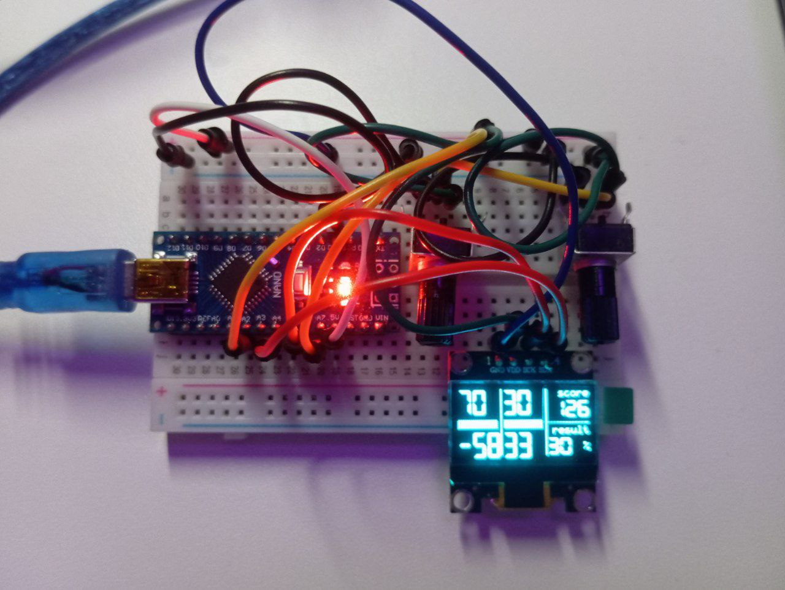

# MatrixGame

## :computer:[Ссылка на презентацию](https://docs.google.com/presentation/d/199Ucdy26b98wDu1JAfwCANxR6Ri18mbJcGqCX_KfC_4/edit?usp=sharing)
В презентации помимо прочего указана теория, сборка и инструкция по использованию

## :joystick:[Виртуальный проект на Ardruino](https://wokwi.com/projects/417100984973198337)
Проект, созданный по реальному макету Ardruino с помощью эмулятора Wokwi

## Ресурсы (src)
### :card_index_dividers:src/ardruino
Код выполненный на Ардруино для сборки собственной модели в жизни или в эмуляторе

### :card_index_dividers:src/port_on_desktop
Реализация матричной игры, при которой вместо таймера игроки отправляют результаты выборов по кнопке
